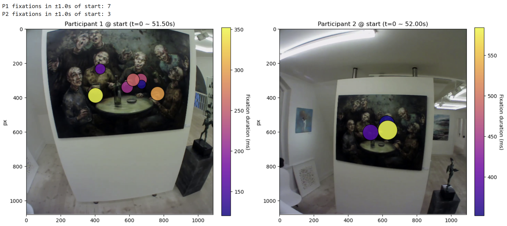

# GAZE_ANALYSIS
This project analysis gaze behaviour of 2 participants in 2 instances

## Research Question:
How does initial spatial fixation patterns (1 second) and the evolution of gaze over the first 5 seconds of a dynamic visual task reveal differences and commonalities in individual perceptual strategies among participants?

## Aim: 
To identify early attention orientation, Individual visual strategy differences, Saliency-driven attention.

## Methodology:
Dataset: Pupil Labs recording (dynamic task - Walking).
Participants: 2 individuals.
Metric: Fixation duration (ms) and spatial distribution.
Analysis Window: 
1-second static fixation overlay around start time (P1 = 51.5s, P2 = 52s).
5-second fixation heatmap overlay.
Visualization: Fixation location and duration mapped as circles on scene frame. 

## Key Findings:

Static fixation Overlay :
 
P1 fixations: distributed broadly across painting → exploratory visual search strategy.
P2 fixations: clustered on the central figures → focused, goal directed attention.

Early fixation behaviours reveal individual differences in attentional strategy: some people start with broad scanning; others directly focus on salient elements. (Cañal-Bruland et al., 2011)

Heatmap Fixation Overlay:
 

P1: Fixations quickly concentrated on key regions → Demonstrates task-oriented, rapid prioritization.
P2: Fixations distributed over wider areas  → Exploratory, information-seeking strategy.

In the first 5 seconds, P1’s gaze stabilizes quickly on central or meaningful elements, whereas P2 continues to scan multiple areas.

Individual differences in visual attention → distinct perceptual strategies (Huang et al. 2015).
Early differences in gaze evolution may shape subsequent motor planning and readiness for interaction, which is critical for understanding collaborative or joint action tasks. (Cañal-Bruland, R., & Mann, D. L. 2015)

